# Multi-Sensor-EKF-Localization

⭐ **1. Introduction**

This project focuses on the implementation of a state estimation system for autonomous vehicles by fusing measurements from multiple onboard sensors. The primary objective is to accurately estimate the vehicle’s pose and velocity in real time under noisy and uncertain conditions.

To achieve robust localization, the system integrates data from GNSS, IMU, and LiDAR sensors. Each sensor contributes complementary information: GNSS provides global position measurements, IMU delivers high-frequency inertial data, and LiDAR aids in correcting drift and improving spatial awareness through environmental observations.

<table>
  <tr>
    <td align="center">
      <b></b> 
      
    </td>
  </tr>
</table>

---

🧩 **2. Challenge**

This project addresses the challenges of accurate state estimation and localization for autonomous vehicles using multi-sensor fusion.

Key challenges include:

- Sensor failures and degraded measurements (e.g., GNSS dropouts in tunnels or urban canyons), leading to loss of absolute positioning information.  
- Growing state uncertainty over time, especially when relying heavily on IMU integration without external corrections.  
- Multi-rate and asynchronous sensor fusion, where IMU (~200 Hz) and LiDAR (~10–20 Hz) operate at different frequencies, requiring precise temporal alignment.  
- Accuracy constraints for safe autonomous driving, where even small localization errors can affect lane-level positioning and decision-making.  

---

🎯 **3. Objectives**

- Develop a multi-sensor state estimation framework to accurately estimate vehicle pose and velocity in real time  
- Design an Error-State EKF to fuse high-frequency IMU data with GNSS and LiDAR measurements  
- Improve localization robustness by handling sensor noise, failures, and asynchronous measurement updates  
- Evaluate estimator performance through trajectory reconstruction and comparison against ground truth data

---

🛠 **4. Tech Stack**

The key methods used in this rpoject include:

- CARLA Simulator – autonomous driving simulation environment
- Python – core implementation of the ES-EKF sensor fusion pipeline  
- NumPy – numerical computations for state propagation, covariance updates, and linear algebra  
- Matplotlib – visualization of trajectories, estimation error, and uncertainty bounds  
- GNSS / IMU / LiDAR data – multi-sensor inputs for real-world vehicle localization  
- Quaternion-based math utilities – orientation representation and update operations  
- Kalman Filter framework (ES-EKF) – probabilistic state estimation and sensor fusion method

---

🧠 **5. Key Concepts & Implementation**

*(A) Need for multiple sensors*  
Autonomous vehicles rely on multiple sensors because no single sensor is reliable enough to provide accurate and continuous localization under all driving conditions. Each sensor has complementary strengths and weaknesses, making sensor fusion essential for robust state estimation. This motivates the use of sensor fusion techniques to combine complementary measurements into a single, consistent estimate of the vehicle state.
<table>
  <tr>
    <td align="center">
      <b>Sensor Stack </b> 
      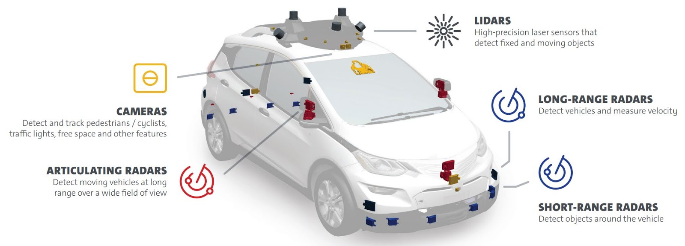
    </td>
  </tr>
</table>

*(B) Kalman Filter and ES-EKF*  
This project uses an Error-State Extended Kalman Filter (ES-EKF) to recursively estimate the vehicle’s state by combining a motion model with noisy sensor measurements. The filter operates in two steps: a prediction step driven by IMU data, and a correction step using GNSS and LiDAR observations.

The ES-EKF formulation improves numerical stability by estimating small error states around a nominal trajectory, making it well-suited for highly non-linear vehicle dynamics and real-world sensor noise.

<table>
  <tr>
    <td align="center">
      <b>Estimation Workflow Setup</b> 
      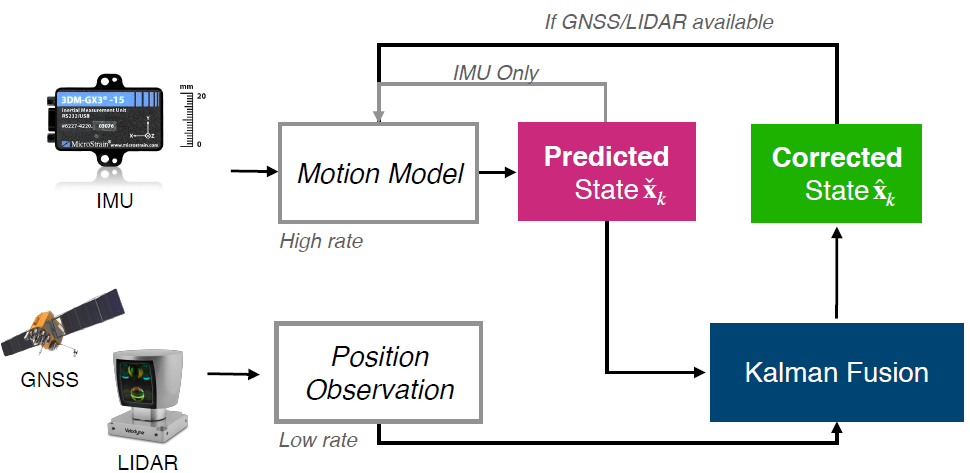
    </td>
  </tr>
</table>

*(C) Motion Model - State Representation*  
The system tracks the vehicle’s position, velocity, and orientation (using quaternions) in 3D space. Instead of directly estimating large changes in these values, the ES-EKF focuses on estimating small errors around a predicted motion, which are then used to continuously refine the state for better accuracy and stability.

A more detailed derivation of the ES-EKF formulation is provided in the references section.

<table>
  <tr>
    <td align="center">
      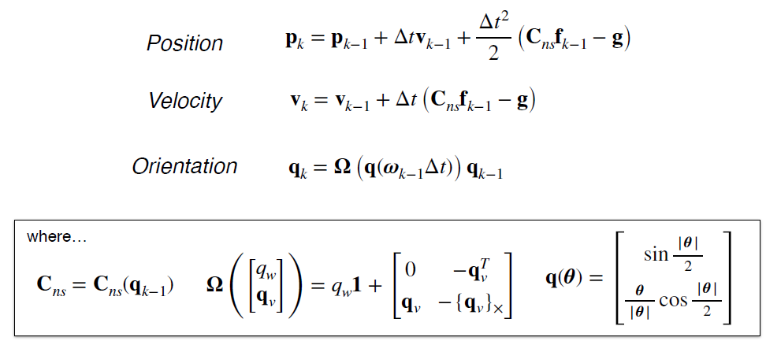 
      <b></b> Motion Model
    </td>
    <td align="center">
      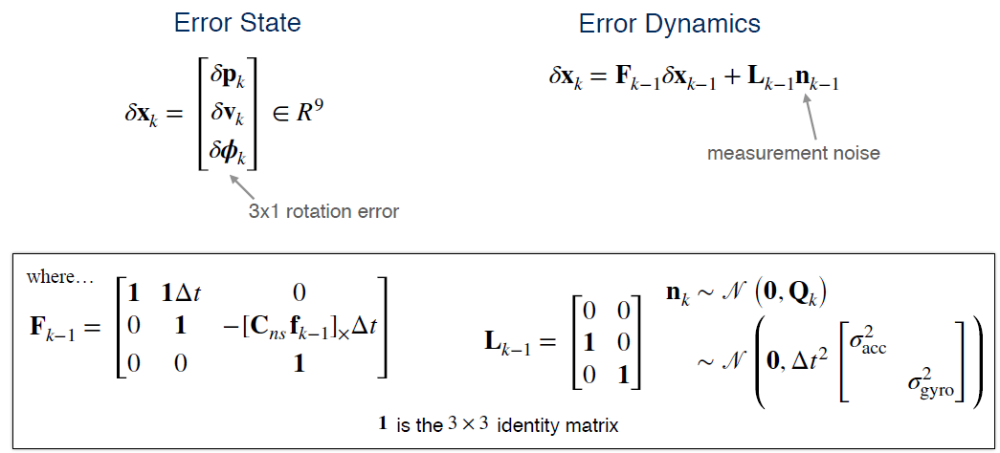 
      <b></b> Error Model
    </td>
  </tr>
</table>

*(D) Position Observation (GNSS & LiDAR)*  

In this project, both GNSS and LiDAR are modeled as direct noisy observations of the vehicle’s position in the inertial frame. Each measurement is assumed to be corrupted by additive Gaussian noise, characterized by a sensor-specific covariance.

The GNSS and LiDAR covariances define how much trust is placed in each sensor during the correction step of the ES-EKF.

<table>
  <tr>
    <td align="center">
      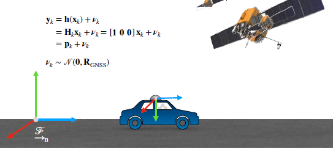 
      <b></b> Global Navigation Satellite System (GNSS)
    </td>
    <td align="center">
      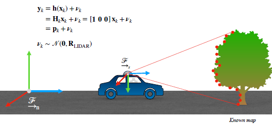 
      <b></b> Light Detection and Ranging (LIDAR)
    </td>
  </tr>
</table>

*(E) EstimationLoop*

The ES-EKF operates in a continuous loop, alternating between prediction using IMU data and correction using GNSS/LiDAR measurements.

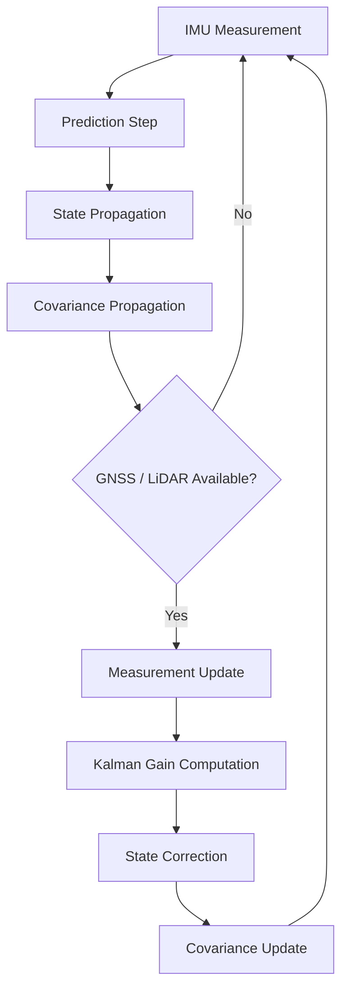

NOTE: In the chart above, **State propagation** refers to the step where the vehicle state (position, velocity, and orientation) is predicted forward in time using the motion model and IMU measurements.  

**Covariance propagation** is the step where the uncertainty of the predicted state is updated based on the motion model and process noise.

---
📈 **6. Simulation Results**

**Case 1: Ideal working of sensors**

<table>
  <tr>
    <td align="center">
      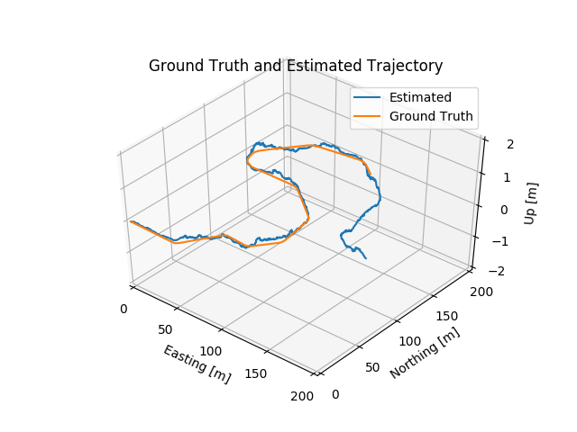 
      <b></b> Estimated Trajectory compared with ground truth
    </td>
    <td align="center">
      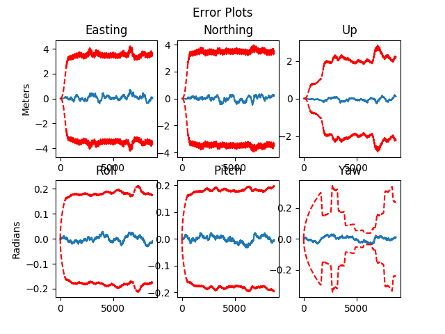 
      <b></b> (Red Threshold - 3 Std. Dev. from ground truth | Blue - Error in estiomation model)
    </td>
  </tr>
</table>

**Case 2: Poorly calibrated sensors**

<table>
  <tr>
    <td align="center">
      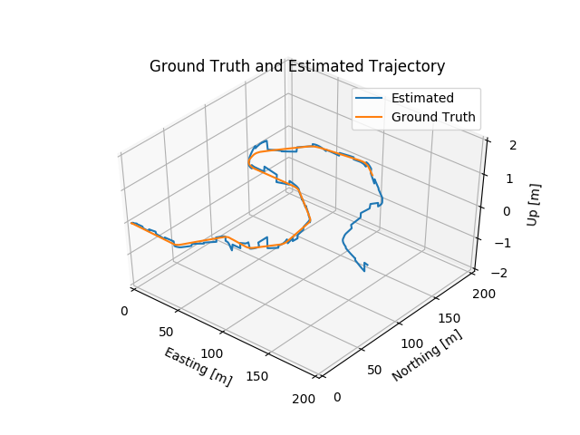 
      <b></b> Estimated Trajectory compared with ground truth
    </td>
    <td align="center">
      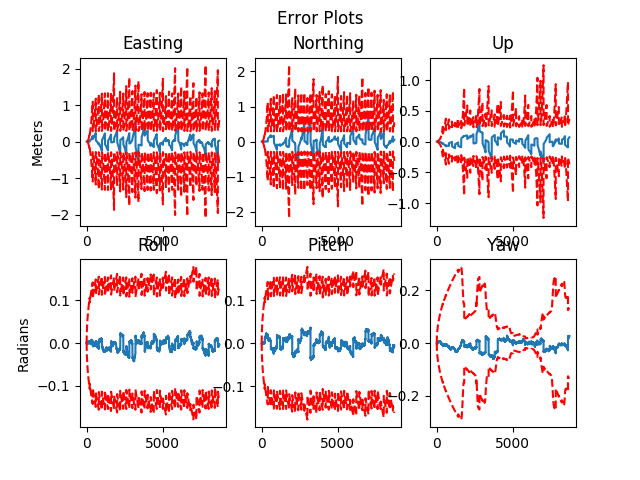 
      <b></b> (Red Threshold - 3 Std. Dev. from ground truth | Blue - Error in estiomation model)
    </td>
  </tr>
</table>

**Case 3: Drop in sensor Information (e.g. inside a tunnel)**

<table>
  <tr>
    <td align="center">
      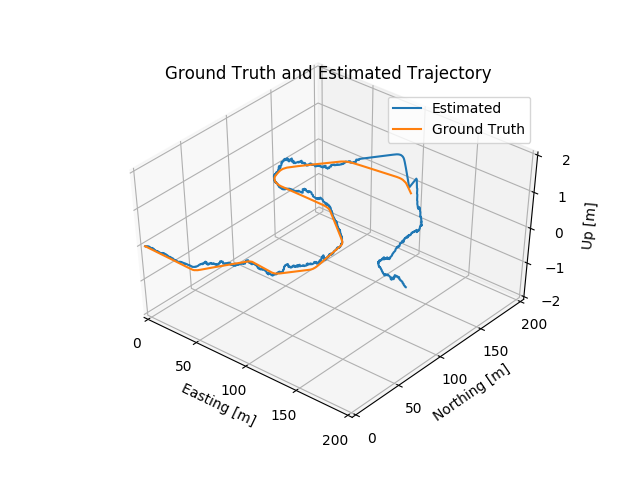 
      <b></b> Estimated Trajectory compared with ground truth
    </td>
    <td align="center">
      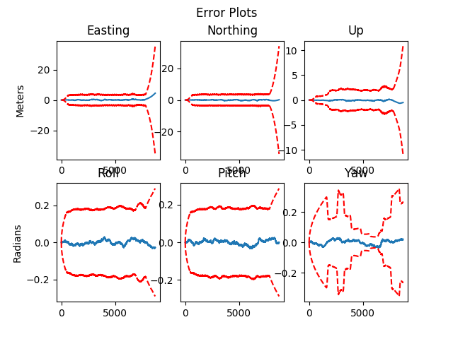 
      <b></b> (Red Threshold - 3 Std. Dev. from ground truth | Blue - Error in estiomation model)
    </td>
  </tr>
</table>

Across all three scenarios, the developed estimator maintains stable performance with estimation errors remaining within acceptable uncertainty bounds.

---
🧭 **7. Future Extensions**

Potential next-stage improvements for this project include:

- Testing and validation on additional datasets or longer trajectories to evaluate long-term drift and stability
- Improved sensor fusion by tuning noise parameters (IMU, GNSS, LiDAR) based on driving conditions or data quality  
---

⚠️ **8. Data Note**

This project was developed as part of the Self-Driving Cars Specialization from the University of Toronto and serves as a demonstration of multi-sensor state estimation using ES-EKF.

It is built using open-source tools and publicly available datasets for GNSS, IMU, and LiDAR-based localization.

No proprietary or sensitive data is included in this repository.

---

👨‍💻 9. **Skills Demonstrated**

This project demonstrates the end-to-end implementation of a multi-sensor state estimation system for autonomous vehicle localization using ES-EKF.

Through this project, I showcase the following skills

- Design and implementation of a real-time sensor fusion pipeline for vehicle state estimation  
- Application of Error-State Extended Kalman Filter (ES-EKF) for position, velocity, and orientation tracking  
- Integration of GNSS, IMU, and LiDAR data with coordinate frame alignment  
- Modeling of sensor noise and uncertainty through covariance-based filtering  
